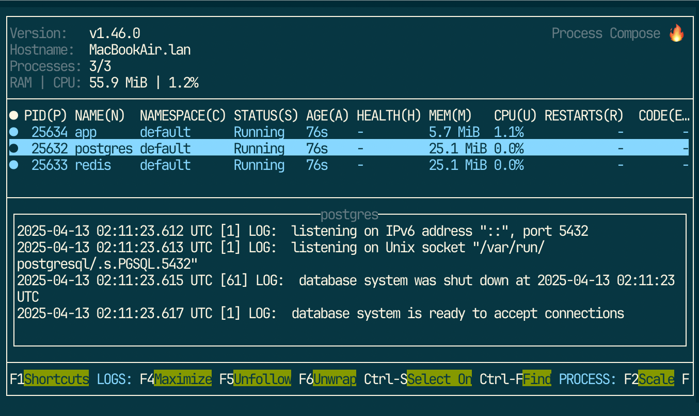

# Panini


**Rapid Development Environment Managment.**


## Install

```
pip install panini
```

## Quickstart

Write this to the `pan.ini` file.
```ini
[postgres]
postgres=17.4
password=devpass

[redis]

[devbox]
nix=
  process-compose
  uv

[app]
cmd=uv run python3 app.py
via=devbox

[up]
services=
    postgres
    redis
    app
via=devbox

[help]
help       = Manage testapp
postgres   = Start postgrees server
redis      = Start redis server
devbox     = Run something inside nix
app        = Start testapp
up         = Run app and dependencies.
```

Run any of the defined commands, for example:
```
$ panini up
```



## Congratulation!

**You got**

- An isolated development environment (Based on nix and docker)
- Handy commands to manage your app
- Easily run your whole app and its dependencies

**Forget the days of**

- Containerizing everything so it fits into `docker compose`
- Slow test runs because of docker for mac.
- Huge YAML files nobody understands.
- Many weird files in your repo that barely accomplish the same.
- Isolated development environments are not a luxury anyomore.

---
