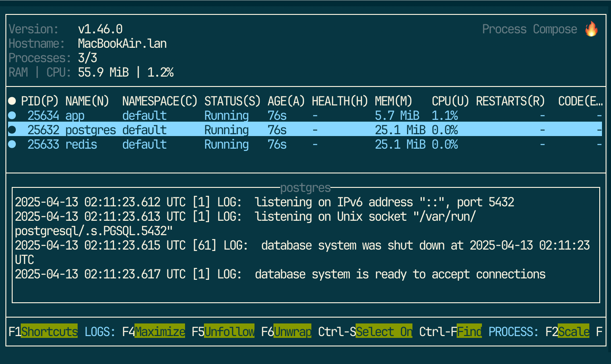

# Panini

Panini is a powerful yet simple way to rapidly define isolated, pinned, and
unified development environments.


## Step 1 - Install

```
pip install panini-compose
```

## Step 2 - Write a `pan.ini` file

```ini
[postgres]
postgres=17.4
password=devpass

[redis]

[devbox]
nix=
  process-compose
  uv
  git

[app]
cmd=uv run python3 app.py
via=devbox

[uv]
cmd=uv {}
via=devbox

[up]
services=
    postgres
    redis
    app
via=devbox

[help]
help       = Manage testapp
app        = Start testapp
devbox     = Run something inside nix
postgres   = Start postgrees server
redis      = Start redis server
up         = Run app and dependencies.
uv         = Run uv
```


## Step 3 - Run panini

```
$ panini up
```

